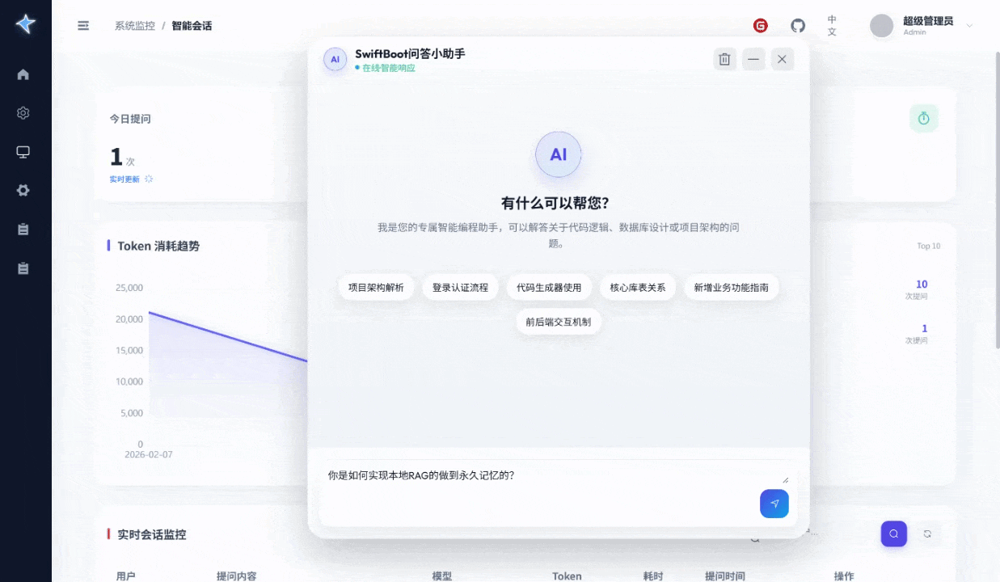
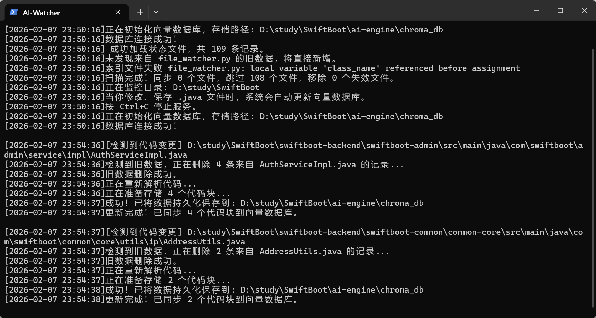
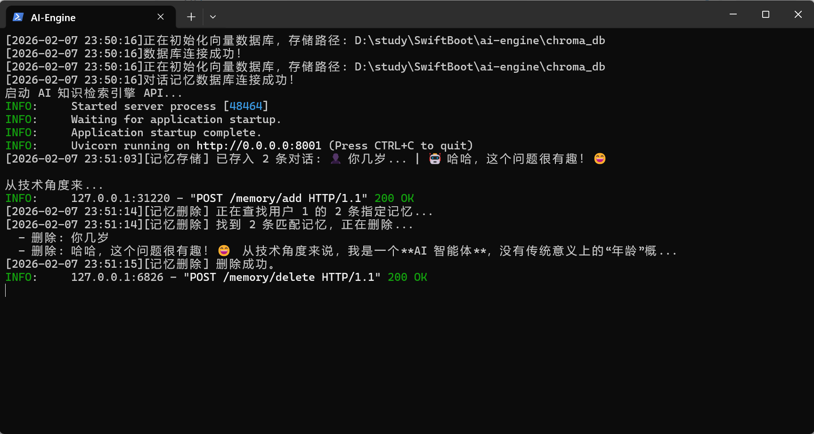
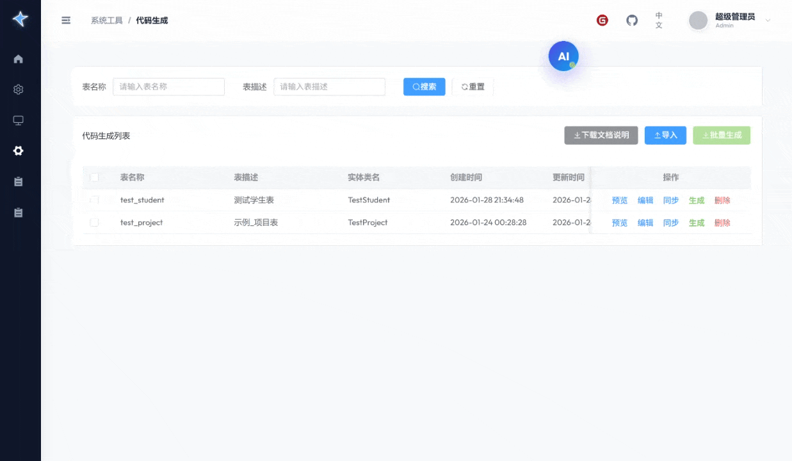

# SwiftBoot 现代化轻量级框架 🚀

> **不仅是后台管理框架，更是拥有“大脑”的智能开发平台。**

SwiftBoot 是一个基于 **Spring Boot 3 + Vue 3** 的现代化全栈框架。在 v0.1.5+ 版本中，我们引入了革命性的 **本地 RAG（检索增强生成）架构**，让框架具备了**自我认知**能力。

它不再只是冷冰冰的代码库，而是一个**读得懂源码、跟得上变更、答得出逻辑**的智能编程伙伴。

---

## ✨ 核心特性 (v0.1.5+ 新增)

### 1. 🧠 RAG 智能问答引擎
告别传统的“通用型 AI”。SwiftBoot 内置了基于 **DeepSeek** 模型 + **ChromaDB** 向量数据库的本地 RAG 引擎。
*   **私有化知识库**：AI 并非瞎编乱造，而是基于你项目中的 **真实代码** 和 **开发文档** 进行回答。
*   **精准检索**：当你提问“用户登录是怎么实现的？”时，系统会先在向量库中检索 `SysUserController`、`Sa-Token` 配置等相关代码片段，再喂给 AI 生成答案。
> 

### 2. 👁️ 代码上下文感知
SwiftBoot “认识”你的每一行代码。
*   **架构理解**：它知道 `sys_user` 表和 `sys_dept` 表的关联关系，也知道你的 `GlobalExceptionHandler` 是如何处理异常的。
*   **源码级溯源**：AI 的回答会引用具体的类名、方法名，甚至能告诉你代码在哪个文件里。


### 3. ⚡ 自动代码切片监听 (Hot-Reload)
这是我们最引以为傲的功能之一。
*   **实时监听**：内置 Python `file_watcher` 服务，像热部署一样监听你的 `.java` 文件变更。
*   **增量同步**：当你修改了业务逻辑并保存文件，系统会在 **秒级** 内自动重新切片、向量化并更新到数据库。
*   **即时生效**：你刚写完的新功能，下一秒问 AI，它就能准确解释出来。

>

### 4. 🔄 业务逻辑实时同步
不再担心文档滞后于代码。
*   **动态文档**：你的代码就是文档。随着代码的迭代，AI 的“大脑”也在实时进化。
*   **三端记忆同步**：实现了 数据库(审计) + Redis(短期对话) + 向量库(长期记忆) 的 **三端精准同步**。删除一条对话，所有相关记忆彻底清除，绝无残留。

> 
---

## 💎 经典特性 (持续打磨)

### 5. 📖 字典“一等公民”
*   **统一治理**：前后端字典自动同步，告别硬编码。
*   **自动回显**：前端 `<DictTag>` 组件自动处理回显，无需手写 `if-else`。
*   **生成器联动**：代码生成器自动识别字典字段，直接生成下拉框代码。

### 6. ⚙️ 生产级代码生成
*   **所见即所得**：可视化配置字段类型、组件类型、校验规则。
*   **完整闭环**：一键生成从 Controller 到 Vue 页面的全部代码，包含权限控制和接口定义，拿来即用。
> 

### 7. 📊 智能监控大屏
*   **智能问答中心**：实时监控 AI 对话数据，包括 Token 消耗、响应耗时、活跃用户榜等核心指标。
*   **基础资源监控**：直观展示服务器 CPU、内存、磁盘、JVM 等基础资源使用情况。

> 
> 
---

## ⚡ Quick Start (v0.1.5+)
> 如果 5 分钟内跑不起来，那就是我们的失败。

### 1️⃣ 环境准备
*   **Java**: JDK 17+
*   **Database**: MySQL 8.0+, Redis 7.x+
*   **Frontend**: Node.js 16+, pnpm/npm
*   **AI Engine**: Python 3.10+ (推荐 Conda 环境)

### 2️⃣ 获取代码
```bash
git clone https://github.com/328pikapika-bot/SwiftBoot.git
cd SwiftBoot
```

### 3️⃣ 一键启动 (Windows)
我们提供了整合启动脚本，自动拉起后端、前端和 AI 引擎。

1.  修改 `swiftboot-backend/src/main/resources/application.yml` 配置数据库/Redis。
2.  修改 `quick-start/start_config.ini` 配置你的 Python 环境路径和密码项。
3.  双击运行 **`quick-start/start_all.bat`**。

### 4️⃣ 分步启动 (可选)

*   **后端**: `cd swiftboot-backend && mvn spring-boot:run`
*   **前端**: `cd swiftboot-ui && npm run dev`
*   **AI 引擎**:
    ```bash
    cd ai-engine
    pip install -r requirements.txt
    python main.py  # 启动 API 服务
    python file_watcher.py # 启动代码监听
    ```

访问地址：`http://localhost:30328` (默认账号: `admin` / `123456`)

---

## 🛠️ 技术栈清单

### 后端 (Java)
*   **Framework**: Spring Boot 3.2
*   **ORM**: MyBatis Plus
*   **Security**: Sa-Token
*   **Utils**: Hutool, MapStruct

### 前端 (Vue 3)
*   **Core**: Vue 3 + TypeScript + Vite
*   **UI**: Element Plus + Tailwind CSS
*   **State**: Pinia

### AI 引擎 (Python)
*   **LLM**: DeepSeek API
*   **Vector DB**: ChromaDB (本地嵌入式)
*   **Framework**: FastAPI
*   **Tools**: Watchdog (文件监听), LangChain (文本切片)

---

## 🤝 参与共建

SwiftBoot 正在高速迭代中，v0.1.5 标志着我们向“智能开发框架”迈出了重要一步。

*   🐛 **Issue**: 遇到 Bug 或有新想法？欢迎提 Issue。
*   🌟 **Star**: 如果这个项目对你有帮助，请点个 Star 支持我们！

**作者信息**：
*   Gitee：[https://gitee.com/cs_shuang/SwiftBoot](https://gitee.com/cs_shuang/SwiftBoot)
*   GitHub：[https://github.com/328pikapika-bot/SwiftBoot](https://github.com/328pikapika-bot/SwiftBoot)
*   联系方式：17334981104 (同微信)
